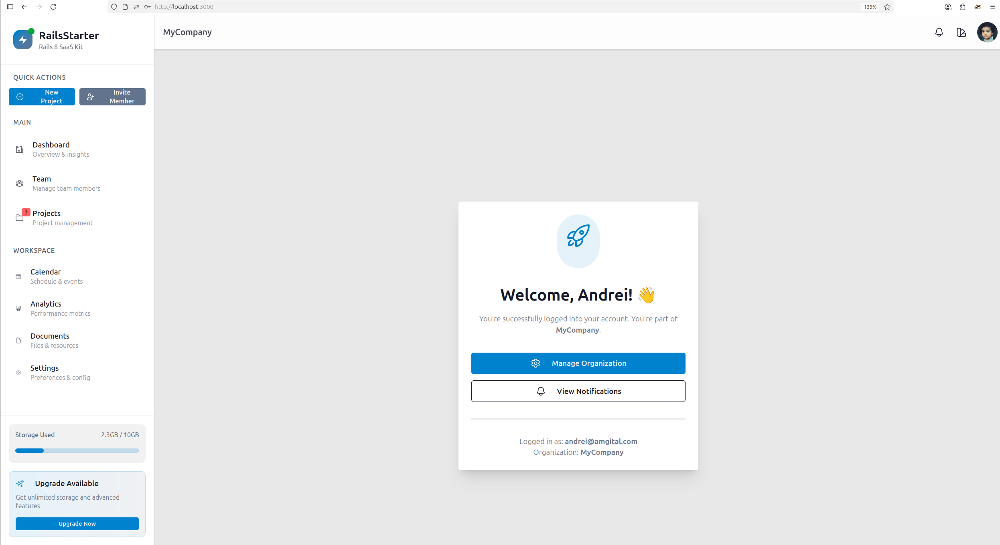
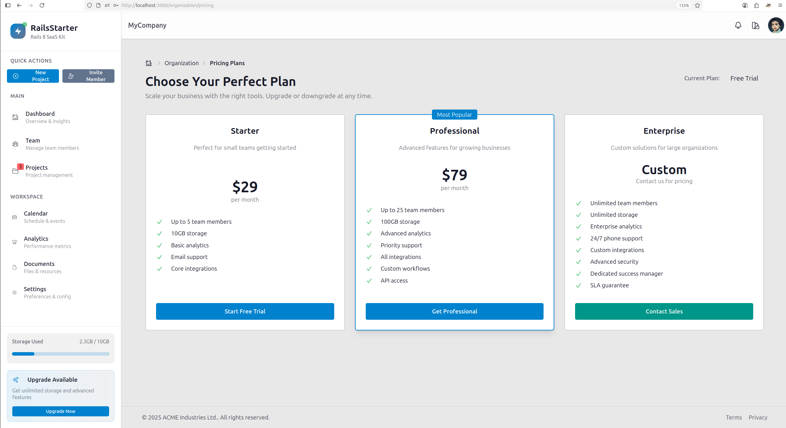
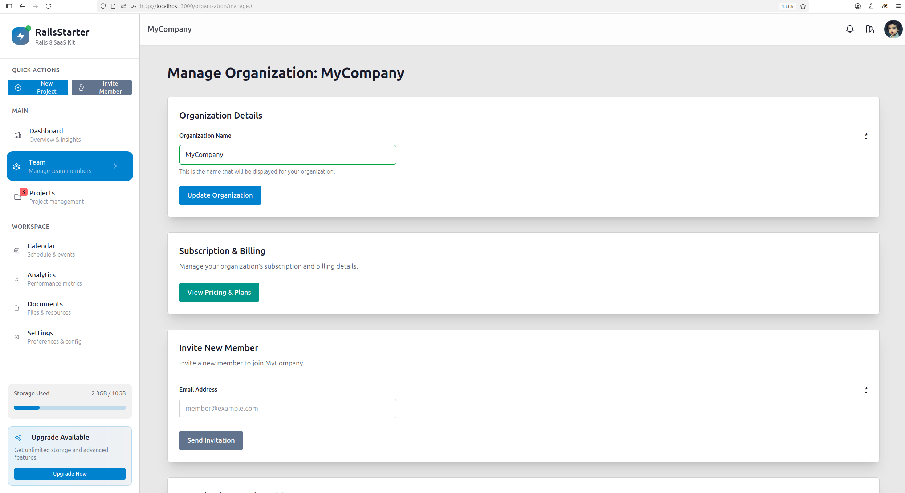
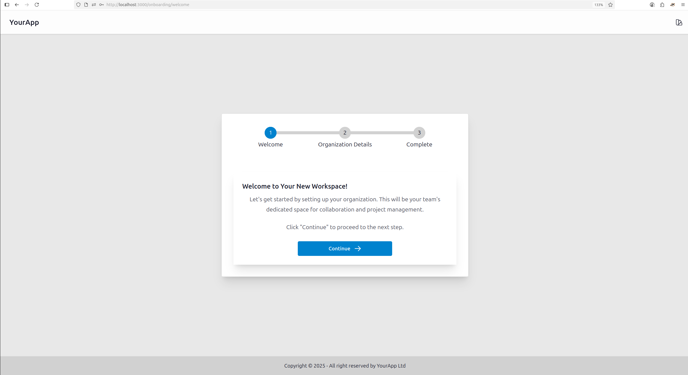

# 🚀 Rails SaaS Kit

**Enterprise-grade Ruby on Rails SaaS starter kit with multi-tenancy, Stripe payments, and modern UI**

A production-ready foundation for building scalable B2B SaaS applications with sophisticated architectural patterns, enterprise authentication, and a beautiful modern interface.

[](https://ruby-lang.org)
[](https://rubyonrails.org)
[]()
[](LICENSE)
[]()

---

## 📸 Screenshots

### Dashboard & Home

*Clean, professional dashboard with sidebar navigation and organization management*

### Pricing & Subscriptions  

*Flexible pricing tiers with Stripe integration - Starter ($29), Professional ($79), and Enterprise*

### Team Management

*Complete organization management with member invitations and role-based permissions*

### Onboarding Experience

*Guided multi-step onboarding wizard for smooth user experience*

---

## ✨ Key Features

### 🏢 **Multi-Tenant Architecture**
- **Organization-based tenancy** with complete data isolation
- **Domain-based tenant resolution** for enterprise customers
- **Role-based access control** (Member, Admin, Owner)
- **Secure tenant scoping** using `acts_as_tenant`

### 💳 **Stripe Payments Integration**  
- **Event-driven webhook handling** for reliable payment processing
- **Flexible subscription management** with upgrade/downgrade support
- **Multiple pricing tiers**: Starter ($29/mo), Professional ($79/mo), Enterprise (custom)
- **Trial periods and cancellation** handling
- **JSONB storage** for evolving payment data

### 🔐 **Enterprise Authentication**
- **Multi-provider OAuth**: GitHub, Google, Microsoft Entra ID
- **Per-domain Enterprise SSO** for B2B customers  
- **Invite-based team management** with Devise Invitable
- **Platform admin system** with global access controls

### 🎨 **Modern UI Architecture**
- **DaisyUI component library** with multi-theme support
- **ViewComponent architecture** for reusable, testable UI components
- **Responsive design** with TailwindCSS
- **Professional sidebar navigation** with clean iconography

### 🔄 **Advanced Business Logic**
- **Railway-Oriented Programming** with dry-rb ecosystem
- **Service layer pattern** using Dry::Workflow + Dry::Monads
- **Type-safe error handling** with Success/Failure monads
- **Comprehensive logging** and audit trails

### 📋 **User Experience**
- **Multi-step onboarding wizard** using Wicked gem
- **In-app notifications** with Noticed gem
- **Background job processing** with Solid Queue + dashboard
- **Email management** with Letter Opener (development)

---

## 🛠 Tech Stack

### **Backend**
- **Ruby on Rails 8.0** - Latest Rails with modern defaults
- **SQLite3** - Database (easily configurable for PostgreSQL/MySQL)
- **Hotwire (Turbo + Stimulus)** - SPA-like experience without complexity

### **Frontend**
- **TailwindCSS 4.1** - Utility-first CSS framework  
- **DaisyUI 5.0** - Beautiful component library with theme support
- **ViewComponent** - Component-driven architecture
- **esbuild** - Fast JavaScript bundling

### **Business Logic & Services**
- **dry-rb ecosystem** - Railway-oriented programming
  - `dry-workflow` - Business transaction orchestration
  - `dry-monads` - Type-safe error handling
  - `dry-types` - Runtime type checking
- **Pundit** - Authorization with secure-by-default policies

### **Integrations & Extensions**
- **Stripe Rails** - Payment processing with webhook handling
- **Devise + OAuth** - Authentication with social providers
- **Acts As Tenant** - Multi-tenancy with data isolation
- **Noticed** - Notification system
- **Solid Queue** - Background job processing (Rails 8)

### **Development & Testing**
- **RSpec** - Behavior-driven testing framework
- **FactoryBot & Faker** - Test data generation
- **Rubocop Rails Omakase** - Code style and quality
- **Brakeman** - Security vulnerability scanning

---

## 🚀 Quick Start

### Prerequisites
- Ruby 3.3.0+
- Node.js 18+
- SQLite3 (or PostgreSQL/MySQL for production)
- Stripe account for payments

### Installation

1. **Clone the repository**
   ```bash
   git clone https://github.com/yourusername/rails-saas-kit.git
   cd rails-saas-kit
   ```

2. **Install dependencies**
   ```bash
   bundle install
   npm install
   ```

3. **Environment setup**
   ```bash
   cp .env.example .env
   # Configure your environment variables in .env file
   ```

4. **Database setup**
   ```bash
   rails db:create db:migrate db:seed
   ```

5. **Start the application**
   ```bash
   bin/dev
   ```

6. **Visit** `http://localhost:3000` and create your first organization!

### Environment Variables

Configure your environment variables in the `.env` file (copied from `.env.example`):

```bash
# Stripe Configuration
STRIPE_SECRET_KEY=sk_test_your_secret_key_here
STRIPE_PUBLISHABLE_KEY=pk_test_your_publishable_key_here
STRIPE_SIGNING_SECRET=whsec_your_webhook_signing_secret_here

# SMTP Configuration  
SMTP_USERNAME=apikey
SMTP_PASSWORD=your_sendgrid_api_key_here
SMTP_ADDRESS=smtp.sendgrid.net
SMTP_PORT=587

# OAuth Providers (optional)
GITHUB_APP_ID=your_github_app_id
GITHUB_APP_SECRET=your_github_app_secret
```

---

## 🏗 Architecture Overview

### Multi-Tenancy Design
```ruby
# Automatic tenant scoping in controllers
class ApplicationController < ActionController::Base
  set_current_tenant_through_filter
  before_action :set_organization_as_tenant
end

# All models automatically scoped to current organization
class User < ApplicationRecord
  acts_as_tenant(:organization)
  # Users are automatically scoped to current organization
end
```

### Service Layer Pattern
```ruby
# Railway-oriented programming for business logic
class CreateInvitation < ApplicationService
  def call(params)
    user = yield find_user(params[:email])
    invitation = yield create_invitation(user, params)
    yield send_invitation_email(invitation)
    
    Success(invitation)
  end
end

# Clean controller integration
CreateInvitation.call(invitation_params) do |result|
  result.success { |invitation| redirect_to team_path }
  result.failure(:user_not_found) { flash[:error] = "User not found" }
end
```

### Component Architecture
```ruby
# Reusable, testable UI components
class SidebarComponent < ViewComponent::Base
  def initialize(current_user:)
    @current_user = current_user
  end

  private

  def organization_name
    @current_user&.organization&.name || "Your Organization"
  end
end
```

---

## 🔧 Configuration

### Stripe Setup
1. Create your Stripe plans:
   ```bash
   bundle exec rake stripe:prepare
   ```

2. Configure webhook endpoints in Stripe Dashboard:
   - `POST /stripe/webhooks` for subscription events

### OAuth Providers
Configure OAuth applications for:
- **GitHub**: `GITHUB_APP_ID` and `GITHUB_APP_SECRET`
- **Google**: `GOOGLE_CLIENT_ID` and `GOOGLE_CLIENT_SECRET`  
- **Microsoft**: `MICROSOFT_CLIENT_ID` and `MICROSOFT_CLIENT_SECRET`

### Enterprise SSO
For B2B customers, configure per-domain SSO in the admin panel:
- Domain-based OAuth configurations
- Support for Azure AD, Google Workspace, and custom OIDC providers

---

## 🧪 Testing

```bash
# Run the full test suite
bundle exec rspec

# Run with coverage
bundle exec rspec --format documentation

# Security scanning
bundle exec brakeman

# Code style
bundle exec rubocop
```

---

## 📦 Deployment

### Production Setup

1. **Environment Configuration**
   - Set up production environment variables
   - Configure production database (PostgreSQL recommended)
   - Set up Redis for caching and jobs (optional but recommended)

2. **Asset Compilation**
   ```bash
   RAILS_ENV=production bundle exec rails assets:precompile
   ```

3. **Database Migration**
   ```bash
   RAILS_ENV=production bundle exec rails db:migrate
   ```

### Deployment Options
- **Heroku**: Ready for one-click deployment
- **Docker**: Included Dockerfile for containerization  
- **Kamal**: Included configuration for modern deployment
- **Traditional VPS**: Works with Capistrano or similar tools

---

## 🤝 Contributing

We welcome contributions! This codebase follows Rails and Ruby community standards.

### Development Process
1. Fork the repository
2. Create your feature branch (`git checkout -b feature/amazing-feature`)
3. Write tests for your changes
4. Ensure all tests pass (`bundle exec rspec`)
5. Follow code style guidelines (`bundle exec rubocop`)
6. Commit your changes (`git commit -m 'Add amazing feature'`)
7. Push to the branch (`git push origin feature/amazing-feature`)
8. Open a Pull Request

### Code Style
- Follow Rails conventions and Ruby style guide
- Use the included Rubocop configuration
- Write comprehensive tests for new features
- Document complex business logic

---


## 📚 Documentation

- **[Setup Guide](docs/setup.md)** - Detailed installation instructions
- **[Architecture Guide](docs/architecture.md)** - Deep dive into system design
- **[API Documentation](docs/api.md)** - REST API reference  
- **[Deployment Guide](docs/deployment.md)** - Production deployment instructions
- **[Contributing Guide](CONTRIBUTING.md)** - Development workflow

---

## 💡 Why Choose Rails SaaS Kit?

### ✅ **Production-Ready**
- Enterprise-grade architecture from day one
- Comprehensive test coverage
- Security best practices built-in
- Scalable multi-tenant design

### ✅ **Developer-Friendly** 
- Modern Rails 8 with latest features
- Clean, maintainable codebase
- Comprehensive documentation
- Active community support

### ✅ **Business-Focused**
- Built-in subscription billing
- Team management and invitations
- Enterprise SSO for B2B sales
- Professional UI/UX out of the box

### ✅ **Extensible**
- Component-based architecture
- Service layer for business logic
- Event-driven payment system
- Easy to customize and extend

---

## 📄 License

This project is licensed under the MIT License - see the [LICENSE](LICENSE) file for details.

---

## 🙋‍♀️ Support & Community

- **Issues**: [GitHub Issues](https://github.com/yourusername/rails-saas-kit/issues)
- **Discussions**: [GitHub Discussions](https://github.com/yourusername/rails-saas-kit/discussions)

### 🤝 Looking for Maintainers
We're actively seeking dedicated maintainers to help grow and improve this project. If you're passionate about Rails, SaaS architecture, and open source, we'd love to hear from you!

---

<div align="center">

**Built with ❤️ by the Rails community**

[⭐ Star this repo](https://github.com/yourusername/rails-saas-kit) if you find it helpful!

</div>